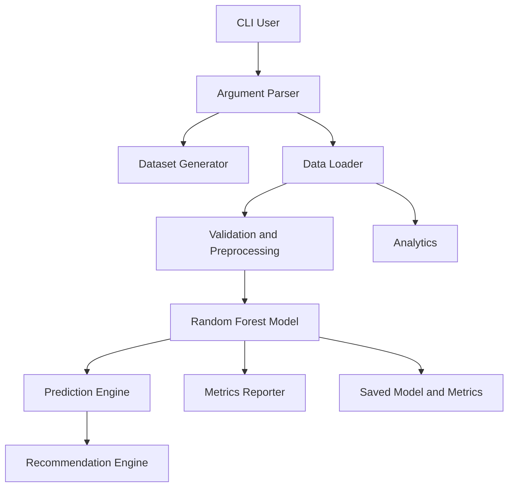

# System Architecture

```mermaid
flowchart TD
A[CLI User] --> B[Argument Parser]
B --> C[Dataset Generator]
B --> D[Data Loader]
D --> E[Validation and Preprocessing]
E --> F[Random Forest Model]
F --> G[Prediction Engine]
G --> H[Recommendation Engine]
D --> I[Analytics]
F --> J[Metrics Reporter]
F --> K[Saved Model and Metrics]
```
