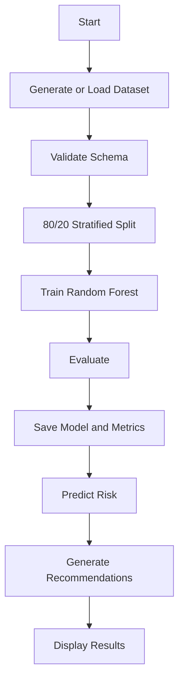

# Workflow

```mermaid
flowchart TD
A[Start] --> B[Generate or Load Dataset]
B --> C[Validate Schema]
C --> D[80/20 Stratified Split]
D --> E[Train Random Forest]
E --> F[Evaluate]
F --> G[Save Model and Metrics]
G --> H[Predict Risk]
H --> I[Generate Recommendations]
I --> J[Display Results]
```
